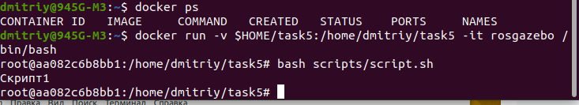

# Отчёт по заданию №5.7
    <h2 align="center">Отчет по практической работе №5.7</h3>
    1. <b>Установка Docker Engine и Docker Compose:</b>
    

    <a href="https://docs.docker.com/engine/install/ubuntu/">Официальная страница установки Docker Engine</a>
    

    Есть несколько способов установки Engine, ниже приведен способ установки с помощью репозитория докера, скорее всего взятый с pdf-файла, прилагаемый к видеоуроку Романа.
    

    sudo apt-get update
    

        Устанавливаем программы, ключ. На официальной странице приложение gnupg не устанавливается.
    

       sudo apt-get install ca-certificates curl gnupg
    

    sudo install -m 0755 -d /etc/apt/keyrings
    

    sudo curl -fsSL https://download.docker.com/linux/ubuntu/gpg -o /etc/apt/keyrings/docker.asc
    

    sudo chmod a+r /etc/apt/keyrings/docker.asc
    

    echo \ 
        "deb [arch=$(dpkg --print-architecture) signed-by=/etc/apt/keyrings/docker.asc] https://download.docker.com/linux/ubuntu \ 
        $(. /etc/os-release && echo "$VERSION_CODENAME") stable" | \ 
        sudo tee /etc/apt/sources.list.d/docker.list > /dev/null
    

       sudo apt-get update
    
Устанавливаю пакеты Docker:

    sudo apt-get install docker-ce docker-ce-cli containerd.io docker-buildx-plugin docker-compose-plugin

    Docker Engine установил.
    
    
Чтобы не выполнять каждый раз команду docker через sudo:
    

        sudo groupadd docker
    

    sudo usermod -aG docker $USER
    

    newgrp docker
    

    
    
<b>Установка Docker Compose:</b>
    

    Compose, я устанавливал два раза. В последний раз, как устанавливал: <a href="https://github.com/docker/compose/releases">на этой странице</a>
    посмотрел последнюю версию (v2.27.1), скопировал и вставил в команду номер версии (красным цветом, что я вставил):
    

    sudo curl -L "https://github.com/docker/compose/releases/download/v2.27.1/docker-compose-$(uname -s)-$(uname -m)" -o /usr/local/bin/docker-compose

    Второй и более понятный способ: 
    <a href="https://github.com/docker/compose/releases">страница релизов</a> &rarr; <a href="https://github.com/docker/compose/tags">Tags</a>  &rarr;  Downloads.  Копируем путь, вставляем в команду, между кавычками:

        sudo curl -L
            "https://github.com/docker/compose/releases/download/v2.27.2/docker-compose-linux-x86_64" -o /usr/local/bin/docker-compose

    
Третий способ из <a href="https://docs.docker.com/compose/install/linux/#install-using-the-repository">официальной страницы</a>, самый простой:
    

        sudo apt-get update

        sudo apt-get install docker-compose-plugin
    

    Далее:
    
sudo chmod +x /usr/local/bin/docker-compose

    
    
Docker CLI, как я понимаю, почти не отличается от обычного терминала, поэтому его не обязательно устанавливать.

    

    2. <b>Разработка простой программы:</b>

    task5 - корневой каталог для этого задания. Внутри task5 создал каталог scripts для всех скриптов.
    

        mkdir scripts

        Баш скрипт:

        #!/bin/bash 
        echo "Скрипт1"
    

    На мой взгляд можно было бы потратить 1-2 урока на python или просто pdf-инструкцию, чтобы писать простейшие скрипты. Зато на Git зачем-то потратили целый модуль, хотя помоему к программированию никакого отношения не имеет. Да и Docker, я так и не понял зачем он нужен.

<b>Репозиторий:</b> Создал репозиторий <a href="https://github.com/DmitriyZubkov41/task5">https://github.com/DmitriyZubkov41/task5</a>.

3. <b>Создание образа для программы:</b> 
Меня заинтересовал проект Антона Писаренко - <a href="https://github.com/AntonSHBK/mobile_robot_base_ros1">Простая имитационная модель мобильного робота в ROS и Gazebo</a>. Dockerfile на 99% состоит из его dockerfile.

Внутри каталога task5 создаём еще один каталог docker для всех докер-файлов.

    <a href="https://github.com/DmitriyZubkov41/task5/blob/main/docker/Dockerfile">Код Dockerfile:</a>

<code><pre>
    # Строим на базе образа ROS 1 версия noetic-desktop
    # Эта версия - последняя поддерживаемая в ubuntu 20.04
    FROM osrf/ros:noetic-desktop
    
    # set environment variables
    ENV PYTHONDONTWRITEBYTECODE 1 # Предотвращает создание .pyc файлов
    ENV PYTHONUNBUFFERED 1        # Предотвращает буферизацию вывода Python, улучшая логирование
    
    #Этот блок вроде предназначен для тех кто имеет в компьютере графический чипсет от NVIDIA
    # Поэтому думаю можно все закомментировать
    # nvidia-container-runtime
    #ENV NVIDIA_VISIBLE_DEVICES \
    #   ${NVIDIA_VISIBLE_DEVICES:-all}
    #ENV NVIDIA_DRIVER_CAPABILITIES \
    #   ${NVIDIA_DRIVER_CAPABILITIES:+$NVIDIA_DRIVER_CAPABILITIES,}graphics
    
    # set work directory
    #RUN mkdir /workspace/src/mobile_robot_base_ros1 -p
    WORKDIR /home/dmitriy/task5
    
    # Additional commands (installing dependencies)
    RUN apt-get update && \
        apt-get install -y \
        curl \                
        wget \                
        python3-pip \         
        python3-tk            # Пакеты длля tkinter
    
    # Gazebo 11
    RUN sudo sh -c 'echo "deb http://packages.osrfoundation.org/gazebo/ubuntu-stable `lsb_release -cs` main" > /etc/apt/sources.list.d/gazebo-stable.list'
    RUN wget https://packages.osrfoundation.org/gazebo.key -O - | sudo apt-key add -
    RUN sudo apt-get install -y libgazebo11-dev 
    # RUN sudo apt-get install -y ros-noetic-gazebo-ros
    # RUN sudo apt-get install -y gazebo11
    
    # Дополнительные пакеты Gazebo для работы с ROS
    # RUN curl -sSL http://get.gazebosim.org | sh
    RUN apt-get update && \
        apt-get install -y \
    #     gazebo11 \
    #     libgazebo11-dev 
        ros-noetic-gazebo-ros \
        ros-noetic-gazebo-ros-pkgs \
        ros-noetic-gazebo-ros-control
    
    # Установка дополнительных пакетов ROS для управления и работы с роботами
    RUN apt-get update && \
        apt-get install -y \
        ros-noetic-control-toolbox \
        ros-noetic-realtime-tools \
        ros-noetic-ros-controllers \
        ros-noetic-xacro \
        python3-wstool \
        ros-noetic-tf-conversions \
        ros-noetic-kdl-parser \
        liburdfdom-tools
    
    # Установка инструментов для разработки
    RUN apt-get update && \
        apt-get install -y \
        nano \
        git \
        tmux \
        tree 
    
    
    # Установка зависимостей Python
    COPY ./requirements.txt /tmp/requirements.txt
    RUN pip install --upgrade pip
    RUN pip install -r /tmp/requirements.txt
    
    # Настройка bashrc
    RUN echo "source /opt/ros/noetic/setup.bash" >> ~/.bashrc
    RUN echo "alias dros='source devel/setup.bash'" >> ~/.bashrc
    
    RUN echo "Сделали"
    </pre></code>

Берём образ ROS1 из docker hub, устанавливаем Gazebo 11 согласно официальному мануалу. Непонятно откуда взялся список дополнительных пакетов ros. Помучился с указанием пути к requirements.txt в инструкции COPY. Странно. 
С инструкцией WORKDIR, думал имеет какое-то отношение к файловой системе хоста, сейчас бы написал <b>task5</b>.  
Далее в task5: 
    touch requirements.txt 
        nano requirements.txt
    

Собираем образ rosgazebo: 
dmitriy@945G-M3:~/task5$ docker build -t rosgazebo -f docker/Dockerfile . 
Непонятно для чего точка стоит в конце, ведь указал путь к dockerfile, но без этой точки команда не работает.

4. Запуск и тестирование программы в Docker-контейнере:

5. Docker Compose

Создал docker-compose.yml на основе docker-compose.yml Антона, запустил его, ничего интересного. Решил свой написать. Поскольку compose - многоконтейнерное приложение, то решил запустить 3 контейнера, каждый в своём окне через tmux и чтобы на каждом выполнился автоматом скрипт и сохранилась командная строка контейнера. Такие были мои хотелки. 
Если попробовать выполнить мои желания в одном контейнере командой docker run:
<ol>
<li>docker run -v $HOME/task5:/home/dmitriy/task5 -it rosgazebo /bin/bash && bash scripts/script.sh

 Тут в результате (контейнер и при выходе - выполнение скрипта) мне всё непонятно. Если считать, что как только команда выполнилась, то контейнер умирает, то результат на мой взгляд должен быть таким: только и сразу выполнение скрипта.

<li>docker run -v $HOME/task5:/home/dmitriy/task5 -it rosgazebo bash scripts/script.sh && /bin/bash
 
Здесь на мой взгляд должно быть то, что я хочу: выполнение скрипта и по команде /bin/bash сохранение контейнера.

<li>docker run -v $HOME/task5:/home/dmitriy/task5 -it rosgazebo /bin/bash && bash scripts/script.sh && /bin/bash

</ol>

    Больше недели экспериментировал с командами run compose, файлами и по отдельности выполнять контейнер из docker-compose.yml командой docker run -rm name_konteyner. Но в идеале никак не получается.

<b>Итоговый код docker-compose.yml:</b> 
<code><pre>
    version: '4'
    services:
      Kont1:
        image: rosgazebo
        volumes:
          - $HOME/task5:/home/dmitriy/task5
        stdin_open: true # docker run -i
        tty: true        # docker run -t
        command: sh -c "bash scripts/script.sh" #скрипт выполняется, но контейнера нет.
      Kont2:
        image: rosgazebo
        volumes:
          - $HOME/task5:/home/dmitriy/task5
        stdin_open: true # docker run -i
        tty: true        # docker run -t
        command: sh -c "bash scripts/script2.sh"
</pre></code>

cd docker 
docker-compose build 
docker-compose up

    
